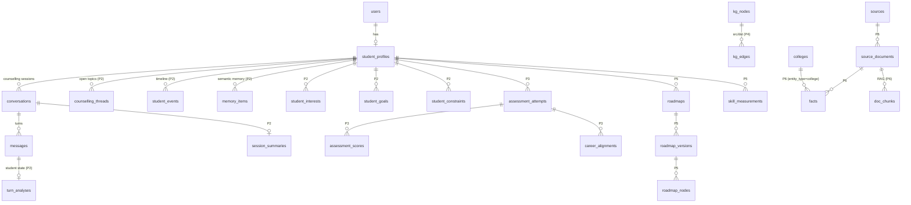

# 02 — Database / ER schema

Target: **PostgreSQL 16 + pgvector** (Phase 2 onward). Phase 1 stays on SQLite; it adds
only columns that SQLite can hold too. Every change ships as an Alembic migration.

Legend — **E** existing, unchanged · **C** existing, changed · **N** new · `(P#)` phase.
Conventions: `id bigserial` PKs, `created_at`/`updated_at timestamptz` on every table
(existing `TimestampMixin`), enums as `text` + CHECK constraint (easy to extend).

## 1. Overview

## 2. Identity, devices, consent

| Table | St. | Columns |
|---|---|---|
| `users` | E | id, email, password_hash, role (`student`\|`parent`\|`counsellor`\|`admin`) |
| `devices` | N (P1) | id, name, key_hash, paired_student_id → student_profiles null, last_seen_at, revoked_at |
| `consents` | N (P2) | id, student_id, kind (`long_term_memory`\|`emotion_signals`\|`voice_retention`\|`guardian`), granted bool, granted_by (`student`\|`guardian`), guardian_contact null, evidence JSONB, granted_at, withdrawn_at |
| `data_requests` | N (P2) | id, student_id, kind (`export`\|`delete_memory`\|`delete_account`), status, requested_at, completed_at |
| `audit_log` | N (P2) | id, actor_user_id, action, entity_type, entity_id, at — reads/writes of memory and profile |

## 3. Student profile

| Table | St. | Columns |
|---|---|---|
| `student_profiles` | C | existing + **education_stage** (`class_6`…`class_12`\|`dropper`\|`ug_y1`…`ug_y5`\|`pg`\|`graduate`), **stream** (`PCM`\|`PCB`\|`PCMB`\|`commerce`\|`humanities`\|null), **birth_year** (age without full DOB), city, **language_stats** JSONB `{en:0.4, hi:0.1, hinglish:0.5}`, **study_hours_per_week**, timezone. `class_level` kept, derived from stage |
| `academic_records` | E | id, student_id, academic_year, class_level, board_percentage, subject_marks JSONB |
| `student_interests` | N (P2) | id, student_id, node_key → kg_nodes.key (career/domain/subject), strength 0–1, status (`active`\|`removed`), source_kind (`conversation`\|`assessment`\|`self`), source_id, first_seen_at, last_confirmed_at |
| `student_goals` | N (P2) | id, student_id, title, kind (`exam`\|`skill`\|`decision`\|`project`\|`other`), target_date, status (`active`\|`done`\|`dropped`), roadmap_node_id null, created_session_id |
| `student_constraints` | N (P2) | id, student_id, kind (`budget`\|`location`\|`relocation`\|`time`\|`family_expectation`\|`other`), value JSONB, **sensitivity** (`normal`\|`sensitive`), status, source_session_id |

## 4. Conversation

| Table | St. | Columns |
|---|---|---|
| `conversations` | C (P1) | existing + started_at, ended_at, channel (`voice`\|`text`\|`mixed`), device_id, status (`open`\|`closed`\|`abandoned`). One row = one counselling session |
| `messages` | C (P1) | existing + **turn_id** uuid, **language** (`en`\|`hi`\|`hinglish`), **script** (`latn`\|`deva`), modality (`voice`\|`text`), **interrupted** bool, **generated_content** text (full LLM output; `content` = what was actually spoken/shown), stt_confidence, **latency** JSONB `{stt_ms, llm_first_token_ms, tts_first_audio_ms, total_ms}`. `content` becomes `text` (no 8000-char cap) |
| `turn_analyses` | N (P2) | message_id PK, intent, topic, emotion_signals JSONB `[{signal, confidence}]`, underlying_concerns JSONB `[{concern, confidence}]`, analyzer_model, created_at |

## 5. Counselling memory (P2) — detail in doc 03

| Table | Columns |
|---|---|
| `counselling_threads` | id, student_id, topic_key (`stream_choice`, `career_direction`, `exam_strategy`…), title, status (`open`\|`parked`\|`resolved`\|`reopened`), decision_status (`undecided`\|`leaning`\|`decided`\|`reopened`), current_position text, open_questions JSONB, actions_agreed JSONB, next_step text, opened_session_id, last_session_id, last_touched_at, resolved_at |
| `session_summaries` | conversation_id PK, schema_version, summary, important_context JSONB, decisions JSONB, unresolved_questions JSONB, new_interests JSONB, goals JSONB, next_steps JSONB, roadmap_changes JSONB, student_state JSONB, threads_touched bigint[], model, created_at |
| `student_events` | id, student_id, event_type (CHECK list in doc 03), occurred_at, actor (`student`\|`ai`\|`system`\|`counsellor`), entity_type, entity_id, payload JSONB, reason text, session_id null. **Append-only** (no UPDATE/DELETE grants except the deletion job) |
| `memory_items` | id, student_id, kind (`fact`\|`preference`\|`concern`\|`aspiration`\|`constraint`), text, text_enc bytea (when sensitive), node_key null, embedding vector(384), salience, confidence, sensitivity, status (`active`\|`superseded`\|`retracted`), superseded_by, source_message_id, source_session_id, last_used_at, expires_at |

## 6. Assessment (P3)

Existing `career_assessments` is migrated into attempts + alignments; the current
question bank (`seed/assessment_questions.json`) becomes instrument `career_interest_v1`.

| Table | Columns |
|---|---|
| `assessment_instruments` | id, key, version, category (`interest`\|`aptitude`\|`logical`\|`academic`\|`skill`\|`personality`\|`learning_pref`\|`work_style`\|`goals`\|`constraints`), stages text[], scoring_method, status (`draft`\|`active`\|`retired`) |
| `assessment_items` | id, instrument_id, key, prompt JSONB `{en, hi}`, item_type (`choice`\|`likert`\|`timed_problem`\|`open`), options JSONB, scoring JSONB (dimension weights or correct answer), requires JSONB, difficulty |
| `assessment_attempts` | id, student_id, instrument_id, instrument_version, mode (`voice`\|`touch`), status, started_at, completed_at, session_id null |
| `assessment_responses` | id, attempt_id, item_id, answer JSONB, transcript null, response_ms, skipped |
| `assessment_scores` | attempt_id, dimension_key → kg_nodes.key (skill/trait/subject), score 0–1, n_items, reliability_note — PK (attempt_id, dimension_key) |
| `career_alignments` | attempt_id, career_key, components JSONB `{interest:0.91, mathematics:0.72…}`, band (`strong`\|`potential`\|`explore`\|`weak`), strengths JSONB, development_areas JSONB, reasons JSONB, questions_to_investigate JSONB |

## 7. Knowledge graph (P4) — detail in doc 04

| Table | Columns |
|---|---|
| `kg_nodes` | id, key (unique, e.g. `career:ai_engineer`), type, name, names_i18n JSONB, attrs JSONB, source_id, status |
| `kg_edges` | id, src_key, dst_key, type, attrs JSONB (e.g. `{level:"intermediate"}`), weight, source_id, valid_from, valid_to — unique (src_key, type, dst_key) |

`career_options` stays as the content store for long-form career guides, keyed by the
same slug as `kg_nodes.key`; its JSON relation columns are migrated to edges and then dropped.

## 8. Roadmap & progress (P5) — detail in doc 09

| Table | Columns |
|---|---|
| `roadmaps` | id, student_id, title, status (`active`\|`archived`), active_version_id |
| `roadmap_versions` | id, roadmap_id, version_no, parent_version_id, trigger JSONB (`{kind:"reassessment", ref:…}`), inputs_snapshot JSONB, rationale text, created_at — **immutable** |
| `roadmap_nodes` | id, version_id, node_key (stable across versions), parent_key, stage, kind (`stage`\|`milestone`\|`module`\|`task`\|`decision`\|`exploration_branch`), title JSONB `{en,hi}`, detail JSONB, prerequisites text[], est_hours, due_window, kg_refs text[], sort |
| `roadmap_progress` | roadmap_id, node_key, status (`not_started`\|`in_progress`\|`done`\|`skipped`), percent, evidence JSONB, updated_at — PK (roadmap_id, node_key); keyed by node_key so progress survives new versions |
| `roadmap_changes` | id, version_id, op (`add`\|`remove`\|`modify`\|`reorder`), node_key, before JSONB, after JSONB, reason |
| `skill_measurements` | id, student_id, skill_key, value 0–1, source_kind (`assessment`\|`practice`\|`project`\|`self_report`), source_id, measured_at — time series; "current" is a view |
| `student_projects` | id, student_id, title, skills text[], status, links JSONB, completed_at |
| `learning_activities` | id, student_id, roadmap_node_key, kind, minutes, at |

Existing `mock_tests`, `questions`, `test_attempts`, `attempt_answers` (E) feed `skill_measurements`.

## 9. Sources, facts, colleges (P6) — detail in doc 06

| Table | St. | Columns |
|---|---|---|
| `sources` | N | id, name, kind (`government`\|`institution`\|`admission_portal`\|`regulator`\|`dataset`\|`secondary`), **tier** 1–6, base_url, notes |
| `source_documents` | N | id, source_id, url, retrieved_at, http_status, mime, sha256, storage_path, effective_date, academic_year, parse_status |
| `facts` | N | id, entity_type, entity_id, attribute, value JSONB, unit, currency, academic_year, effective_from, effective_to, source_document_id, source_locator (page/selector), retrieved_at, verified_at, verified_by (`auto`\|`human`), **status** (`verified`\|`unverified`\|`conflicted`\|`stale`\|`not_available`), confidence, superseded_by |
| `fact_conflicts` | N | id, entity_type, entity_id, attribute, fact_ids bigint[], detected_at, resolution (`unresolved`\|`picked`\|`both_shown`), note |
| `freshness_policies` | N | attribute PK, max_age_days, refresh_trigger (`admission_cycle`\|`days`\|`manual`), stale_after_days |
| `colleges` | C | existing; `is_demo_data` → **data_origin** (`official`\|`fixture`); add lat, lng, address, university_id |
| `college_courses`, `cutoffs`, `courses`, `branches`, `exams` | E | keep; `cutoffs` keeps its row provenance (official JoSAA/MCC files) |
| `fees`, `hostels`, `facilities`, `placements`, `nearby_places` | C | become **views over `facts`** so every value carries per-field provenance; existing rows migrated as facts |
| `admission_events` | N | id, entity_type, entity_id, kind (`application_open`\|`deadline`\|`exam_date`\|`counselling_round`), starts_at, ends_at, fact_id |
| `doc_chunks` | N | id, source_document_id, seq, text, section, lang, entity_refs text[], academic_year, tsv tsvector, embedding vector(384), embed_model |

## 10. Indexes that matter

- `messages (conversation_id, id)`; `student_events (student_id, occurred_at DESC)`
- `counselling_threads (student_id, status, last_touched_at DESC)`
- `memory_items` HNSW on `embedding` (`vector_cosine_ops`) + btree `(student_id, status)` — every vector query is pre-filtered by student
- `kg_edges (src_key, type)`, `(dst_key, type)`
- `facts (entity_type, entity_id, attribute) WHERE superseded_by IS NULL`
- `doc_chunks` HNSW on `embedding` + GIN on `tsv` + GIN on `entity_refs`

## 11. Migration path from today

1. P1: additive columns on `conversations`/`messages`, new `devices`. SQLite-compatible.
2. P2 start: `DATABASE_URL` → Postgres, `alembic upgrade head` on a fresh DB, then a one-off
   copy script from SQLite (users, profiles, conversations, official cutoffs). Seed demo
   colleges are **not** copied; they move to `tests/fixtures/`.
3. Later phases add their tables; old JSON-relation columns are dropped only after data is
   migrated and the API reads from the new tables.
